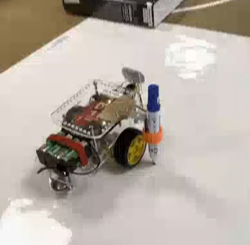
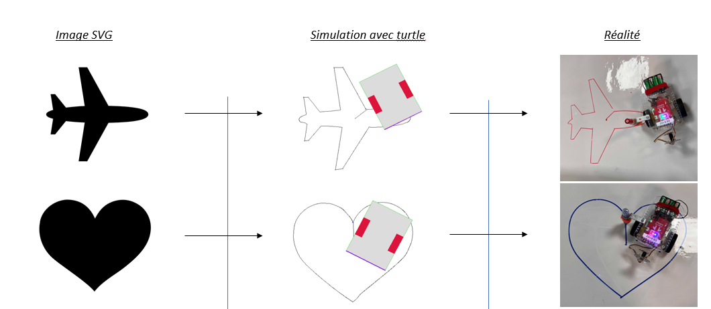

# GoPicasso: Un projet de robot peintre

## Vue d'ensemble du projet
GoPicasso est un système robotisé conçu pour dessiner de manière autonome des images prédéfinies en interprétant et en traçant des fichiers SVG. Le système analyse les fichiers SVG, génère un graphe de coordonnées et trouve un chemin permettant au robot de dessiner l'image complète sans lever le stylo. Le robot corrige en temps réel son trajet grâce à un système d'asservissement basé sur des encodeurs et peut émuler ses mouvements à l'aide du module `turtle` de Python.

## Fonctionnalités

### 1. Parsing SVG
- Charger et analyser un fichier SVG pour extraire les coordonnées.
- Créer un graphe en reliant les points les plus proches pour un dessin en ligne continue.
- Trouver un chemin possible pour dessiner l'image en une seule ligne continue (le stylo reste en bas).

### 2. Courbes de Bézier
- Générer de petits segments à partir des paramètres de la courbe de Bézier.
- Simplifier les segments consécutifs avec des différences d'angle négligeables.
- Demander au robot de se déplacer en douceur entre les points sans arrêts inutiles, permettant un mouvement simultané de rotation et d'avance.

### 3. Centrage dans l'espace
- Le programme de centrage permet au robot de s'aligner correctement dans son espace de travail avant de commencer à dessiner.
- Le robot utilise ses capteurs pour déterminer les dimensions de l'espace de dessin et se place au centre de celui-ci avant de démarrer l'exécution du tracé.

### 4. Asservissement (Contrôle du robot)
- Programme qui gère le déplacement du robot et connaît sa position exacte dans le plan de dessin.
- Utilise les encodeurs pour suivre la rotation des roues et calculer la position en temps réel.
- Auto-correction des écarts entre la position souhaitée et la position réelle.
- Prend en compte le décalage entre le stylo et le centre des roues.

### 5. Environnement d'émulation
- Basé sur le module `turtle` de Python pour la simulation graphique.
- **Classe Bot** : Gère les mouvements du robot et détermine la position en temps réel en fonction de la vitesse de rotation des roues.
- **Classe Playground** : Accueille les robots et fournit une fenêtre de dessin, gère la mise à l'échelle et l'environnement de dessin.
- **Classe GoPiGoBot** : Simule le robot GoPiGo, y compris ses dimensions, l'espacement des roues, et les vitesses maximales du moteur.
- L'émulateur reproduit les fonctions de la bibliothèque GoPiGo pour simuler le robot avec un comportement similaire sur `turtle`.

### 6. Vérificateur de parsing
- Vérifie que le graphe SVG a été correctement analysé en dessinant le graphe sans utiliser le robot.
- Utile pour déboguer les erreurs d'interprétation du graphe.

## Résultat attendu
Après avoir lancé le code, le robot se centre dans l'espace et réalise la forme souhaitée de l'image initiale.

## Bibliothèques Python clés utilisées :
- `numpy`
- `tkinter`
- `turtle`
- `graph`
- `easygopigo3`

## Travaux futurs
- Améliorer la précision du robot grâce à des algorithmes de correction de trajectoire plus avancés.
- Ajouter des techniques plus complexes de lissage des courbes de Bézier.
- Intégrer des capteurs supplémentaires pour une meilleure perception de l'espace et une plus grande précision de dessin.

## Contributeurs
- Ludovic Cure
- Guillaume Poret
